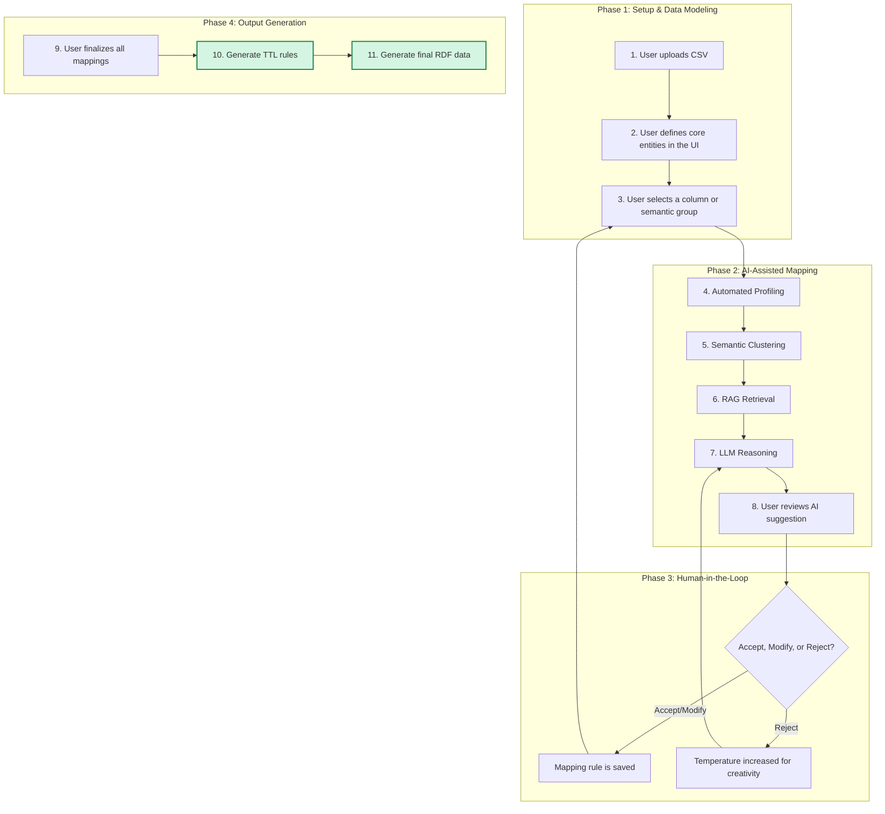

# LingoMap v2.0 - An Interactive Semantic Augmentation Workbench
## Submission for the 2025 OMG Semantic Augmentation Challenge

**Author:** TsaiChen LO  
**Live Demo:** https://lingomap.streamlit.app/

---

## 1. Introduction: Solving the "Semantic Aphasia" of Data

[cite_start]Many datasets are published in formats like CSV with minimal schema or semantic information beyond a row of column names[cite: 3]. [cite_start]This "semantic aphasia" poses a significant challenge for data integration, reliable reporting, and AI applications[cite: 4]. [cite_start]The LingoMap project directly addresses this need by providing a modern, interactive, and AI-assisted workbench to augment datasets with rich, machine-readable semantic metadata[cite: 6].

[cite_start]Our primary objective is to demonstrate a powerful methodology and an accompanying metadata format that is ergonomic, extensible, and leverages state-of-the-art technology to bridge the gap between raw data and formal ontologies[cite: 10, 37].

---

## 2. The LingoMap Metadata Format

[cite_start]The core output of the LingoMap tool is a mapping file in RDF Turtle (.ttl) format[cite: 40]. This file serves as a comprehensive, machine-readable "blueprint" that describes the semantic structure of the source dataset.

### 2.1. Format Principles

[cite_start]Our format design adheres to several best practices[cite: 37]:

- **RDF-Native**: The format is built directly on RDF principles, making it inherently compatible with the semantic web technology stack.

- **Declarative**: It separates the what (the mapping rules) from the how (the transformation process), allowing different tools to interpret the same mapping file.

- **Human-Readable**: Using the Turtle syntax, the rules are organized and commented, making them understandable even to non-technical stakeholders.

- **Component-Based**: The format uses a custom micro-vocabulary (mymap:) to distinguish between different types of mapping rules, such as EntityMapping, ColumnMapping, and AssociationMapping.

### 2.2. Extensibility

[cite_start]While this challenge focuses on CSV, the LingoMap format is designed for extensibility to other formats like JSON and XML[cite: 11, 35]. This is achieved by abstracting the data locator.

- **For JSON**: The `mymap:sourceColumn` predicate could hold a JSONPath expression (e.g., `$.bank.branch.address.city`) instead of a column name.

- **For XML**: It could hold an XPath expression (e.g., `/Bank/Branch/Address/City`).

The core logic of mapping a located data point to a semantic entity and property remains the same, demonstrating the format's flexibility.

---

## 3. The LingoMap Workflow

LingoMap employs a sophisticated, multi-stage workflow that combines automated analysis with human-in-the-loop validation, ensuring both efficiency and accuracy.



---

## 4. Features & Limitations

### 4.1. [cite_start]Key Features [cite: 51]

- **Hybrid Intelligence**: Combines automated data profiling and semantic clustering with advanced LLM reasoning and human expert oversight.

- **Interactive Data Modeling**: Users are empowered to define the high-level data model (Entities and Associations) before the AI fills in the details.

- [cite_start]**Ergonomic UI**: The Streamlit-based interface is intuitive, provides immediate visual feedback, and supports a non-linear workflow[cite: 21, 84].

- **Adaptive AI**: The use of a dynamic temperature parameter after a user rejects a suggestion allows the system to move from "most likely" to "creative" suggestions.

- [cite_start]**Multi-Source RAG**: The knowledge base is built from multiple required sources, including FIBO [cite: 42][cite_start], GeoSPARQL [cite: 42][cite_start], and non-ontology resources like custom definitions [cite: 45][cite_start], demonstrating robustness[cite: 43].

### 4.2. [cite_start]Limitations [cite: 51]

- **API Dependency**: The core suggestion engine relies on an external API (Google Gemini), which requires an internet connection and an API key.

- **Initial Setup**: The first-time setup involves populating the vector database, which can be time-consuming depending on the number of vocabularies.

- **"Cold Start" for Unknown Domains**: While effective for the finance domain with FIBO, performance may vary for completely new domains until relevant vocabularies are added to the knowledge base.

---

## 5. Processing Environment & Transferability

### 5.1. [cite_start]Environment [cite: 53]

The entire solution is built on the open-source Python ecosystem. The key libraries and their roles are:

| Library | Role |
|---------|------|
| **Streamlit** | For the interactive web application |
| **Pandas** | For data handling and profiling |
| **ChromaDB** | For the local vector database (RAG) |
| **Sentence-Transformers** | For generating high-quality semantic embeddings |
| **Google Generative AI** | For LLM-based reasoning |
| **RDFLib** | For parsing and processing vocabularies |

A detailed list of packages and versions is provided in the `requirements.txt` file.

### 5.2. [cite_start]Transferability [cite: 54]

The LingoMap solution is highly transferable:

- [cite_start]**Platform Independent**: Being a Python application, it can run on any major operating system (Windows, macOS, Linux) and is not tied to any proprietary platform[cite: 55].

- **Decoupled Architecture**: The front-end (`app.py`), AI engine (`core_engine.py`), and knowledge base (`vocabulary_processor.py`) are modular. The engine could be repackaged as a standalone library or a microservice.

---

## 6. Scalability

[cite_start]The format and processing are designed with scalability in mind[cite: 59].

### Data Processing
The use of Pandas for CSV I/O is memory-efficient and standard practice for large datasets. The RDF transformation with RDFLib processes data row by row, avoiding loading the entire dataset into memory as a graph.

### AI Processing
The primary bottleneck for very large numbers of columns would be the sequential calls to the LLM API. This can be mitigated by implementing asynchronous or parallel API calls.

### Knowledge Base
The vector database search with ChromaDB is highly optimized and can scale to millions of vocabulary terms with minimal performance degradation.

---

## 7. Use of Identifiers (URIs)

[cite_start]Our approach addresses the use of identifiers as follows[cite: 86]:

### External Identifiers
The core task is to map columns to external, citable URIs from standard ontologies.

### Internal Identifiers
The `ttl2rdf_transformer.py` script is responsible for generating new URIs for each data instance (e.g., each bank branch). [cite_start]It uses a base URI and combines it with a unique, stable value from the source data (e.g., the UNINUM column) to create persistent identifiers that can be preserved across new versions of the dataset[cite: 8].

---

## 8. Quick Start

### Prerequisites
- Python 3.8+
- Google API Key for Gemini
- (Optional) ChromaDB Cloud credentials

### Installation
```bash
# Clone the repository
git clone https://github.com/yourusername/LingoMap.git
cd LingoMap

# Install dependencies
pip install -r requirements.txt

# Set up environment variables
cp .env.example .env
# Edit .env with your API keys

# Run the application
streamlit run src/app.py
```

### Usage
1. Upload your CSV file
2. Define core entities in the UI
3. Select columns for semantic mapping
4. Review and accept AI suggestions
5. Generate TTL mapping rules
6. Transform to final RDF data

---

## 9. Project Structure

```
LingoMap/
├── src/
│   ├── app.py                    # Streamlit web interface
│   ├── core_engine.py           # AI mapping engine
│   ├── vocabulary_processor.py  # RAG knowledge base
│   ├── column_clusterer.py      # Semantic clustering
│   ├── data_profiler.py         # Data analysis
│   ├── ttl2rdf_transformer.py   # RDF transformation
│   └── sparql_validator.py      # Data validation
├── vocabularies/                # FIBO and other ontologies
├── data/                        # Sample datasets
├── requirements.txt             # Python dependencies
├── .streamlit/config.toml       # Streamlit configuration
└── README.md                    # This file
```

---

## 10. Contributing

We welcome contributions! Please see our [Contributing Guidelines](CONTRIBUTING.md) for details.

---

## 11. License

This project is licensed under the MIT License - see the [LICENSE](LICENSE) file for details.

---

## 12. Citation

If you use LingoMap in your research, please cite:

```bibtex
@software{lingomap2025,
  title={LingoMap: An Interactive Semantic Augmentation Workbench},
  author={TsaiChen LO},
  year={2025},
  url={https://github.com/yourusername/LingoMap}
}
```

---

*This README.md provides a comprehensive overview of the LingoMap project, directly addressing the submission and evaluation criteria of the OMG Semantic Augmentation Challenge.*